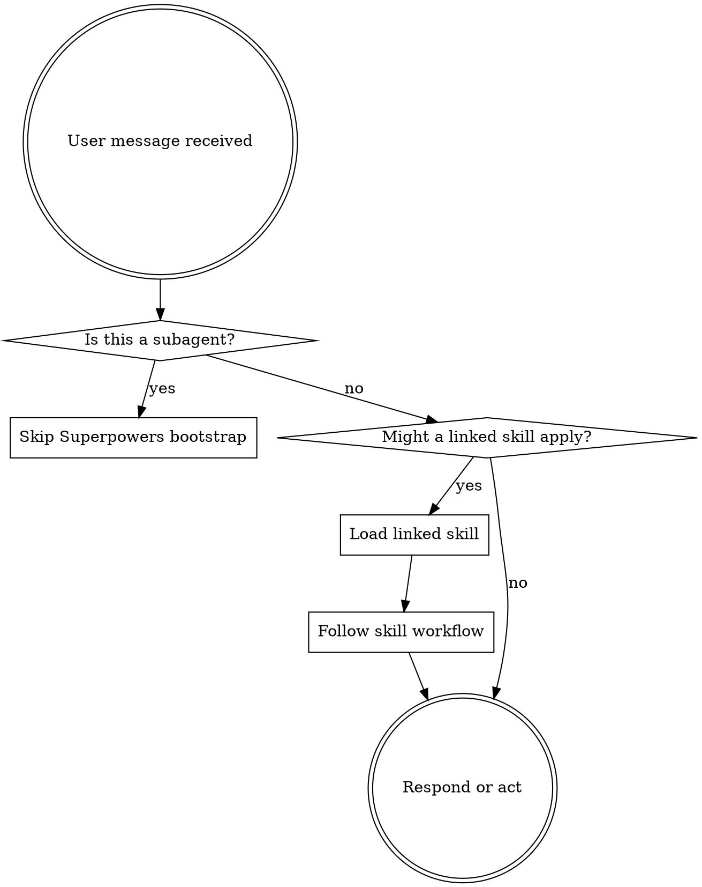

<SUBAGENT-STOP>
If you were dispatched as a subagent to execute a specific task, skip this skill.
</SUBAGENT-STOP>

## Instruction Priority

Superpowers skills override default system prompt behavior where they apply, but
**user and repository instructions always take precedence**:

1. **User's explicit instructions** (`AGENTS.md`, `CLAUDE.md`, direct requests)
2. **Linked Superpowers skills** exposed through `~/.agents/skills`
3. **Default system prompt**

If repository rules exempt a workflow, follow the repository. For example, if a
repo says a one-line change is exempt from TDD, that exemption wins.

## How to Access Skills

**In Codex / OpenCode native skill mode:** use the available skills list and load
the relevant skill content through the native skill mechanism. In this repo,
`~/.agents/skills` is the source for selected native skills.

**In Claude Code:** use the `Skill` tool when the skill is available there.

**Do not** use OpenCode / Codex plugin installation for `vendor/superpowers`.
This repo deliberately exposes only selected skills by symlink. The selection is
managed by `agents/skills.list`; worker dispatch skills are excluded from
`~/.agents/skills`.

## Platform Adaptation

Skills may mention Claude Code tool names. On non-Claude platforms, map the
workflow intent to the host's available tools. Do not load upstream Superpowers
reference files just to get generic tool mappings.

# Using Skills

## The Rule

**Use relevant or requested linked skills before acting.** If a linked skill
clearly applies, load it and follow it. If no linked skill applies, proceed
normally.

Currently linked Superpowers workflow skills in `~/.agents/skills`:

- `systematic-debugging`
- `test-driven-development`
- `writing-plans`
- `verification-before-completion`
- `receiving-code-review`

## Red Flags

These thoughts mean STOP and check the linked skills:

| Thought | Reality |
|---------|---------|
| "This bug is obvious" | Use `systematic-debugging` first. |
| "I'll write tests after" | Use `test-driven-development` first unless exempt. |
| "I'll claim it works from inspection" | Use `verification-before-completion` before completion claims. |
| "This review comment sounds right" | Use `receiving-code-review` to verify it first. |
| "This needs a plan, but I can improvise" | Use `writing-plans` for multi-step plans. |
| "I remember this skill" | Skills evolve. Read the current linked version. |
| "Maybe another Superpowers skill exists" | If it is not linked into `~/.agents/skills`, do not rely on it. |

## Skill Priority

When multiple linked skills could apply, use this order:

1. **Process skills first**:
   - bugs, failures, unexpected behavior: `systematic-debugging`
   - multi-step planning: `writing-plans`
   - review feedback: `receiving-code-review`
2. **Implementation discipline second**:
   - code or behavior changes: `test-driven-development`
3. **Delivery checks last**:
   - before saying work is complete: `verification-before-completion`

Examples:

- "Fix this failing request" -> `systematic-debugging`, then
  `test-driven-development` if code changes are needed.
- "Implement this change" -> `test-driven-development`, unless repository rules
  explicitly exempt it.
- "Review says this is wrong" -> `receiving-code-review` before accepting or
  rejecting the feedback.

## Skill Types

**Rigid** (`systematic-debugging`, `test-driven-development`,
`verification-before-completion`): follow exactly unless user or repository rules
explicitly override.

**Structured** (`writing-plans`, `receiving-code-review`): follow the workflow,
but adapt the level of detail to the task.

## User Instructions

Instructions say WHAT, not always HOW. "Fix Y" does not mean skip debugging
discipline if `systematic-debugging` applies. "Implement X" does not mean skip
TDD unless the repository grants an exemption.

At the same time, do not invent requirements from unlinked Superpowers skills.
This selective setup intentionally documents only the linked skills.
