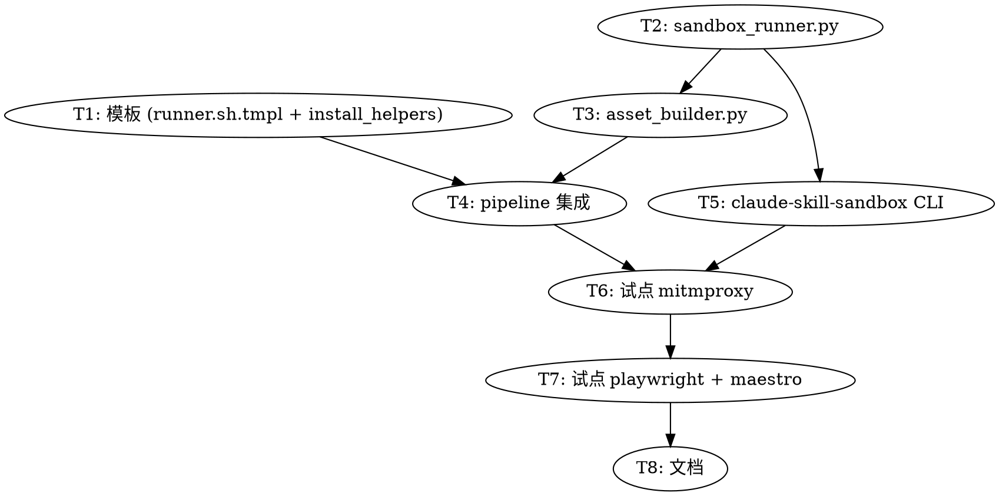

# 可执行 Skill + Docker Sandbox 实施计划

> **For agentic workers:** REQUIRED SUB-SKILL: Use superpowers:subagent-driven-development (recommended) or superpowers:executing-plans to implement this plan task-by-task. Steps use checkbox (`- [ ]`) syntax for tracking.

**Goal:** 让 distill 管线产出"可执行 skill"——除 SKILL.md 外，还携带 distill 阶段实跑过的 install.sh + runner.sh，agent 通过 `bash <skill>/runner.sh` 直接调用工具，工具运行在共享 docker sandbox 不污染主机。

**Architecture:** distill plan 阶段 LLM 输出 `execution_mode + assets[]` schema；build 阶段 LLM 生成每个 asset，立即在 fresh `debian:12-slim` 跑 install + 二次幂等校验 + smoke，3 轮内不通过则标 unverified。runtime 用持久 sandbox `claude-skill-sandbox` + `$HOME → /host_home` mount + cwd 路径翻译，工具一次装入多次复用。详见 spec `docs/superpowers/specs/2026-05-07-executable-skills-docker-sandbox-design.md`。

**Tech Stack:** Python 3.12+ (distill 管线), Bash (runner.sh / install.sh / sandbox CLI), Docker 27+, pytest (单元/集成测试), bats-core (bash 脚本测试).

---

## 文件结构

| 路径 | 操作 | 责任 |
|---|---|---|
| `distill/pipeline.py` | 修改 | plan PROMPT 加 `execution_mode`/`assets`；run_pipeline 加 executable 分支 |
| `distill/asset_builder.py` | 新建 | LLM 生成 asset 脚本 + smoke 验证 + 3 轮重试循环 |
| `distill/sandbox_runner.py` | 新建 | docker pull/run/exec/inspect/diff 的 subprocess 薄包装 |
| `distill/templates/runner.sh.tmpl` | 新建 | runner.sh 模板（按 spec §3 Path B）|
| `distill/templates/install_helpers.sh` | 新建 | retry() helper，注入到每个 install.sh 头部 |
| `distill/tests/test_sandbox_runner.py` | 新建 | sandbox_runner 单元测试（mock subprocess）|
| `distill/tests/test_asset_builder.py` | 新建 | asset_builder 单元测试（mock LLM + mock sandbox）|
| `distill/tests/smoke_test.py` | 修改 | 加 executable_sandbox 端到端集成 case |
| `bin/claude-skill-sandbox` | 新建 | sandbox 生命周期 CLI（status/reset/shell/validate）|
| `tests/test_runner_sh.bats` | 新建 | runner.sh 模板的 bash 行为测试 |

---

## Task 1: Plan schema 扩展 + runner.sh 模板创建

**Files:**
- Modify: `distill/pipeline.py:155-170`（plan schema 示例 JSON 段）
- Create: `distill/templates/runner.sh.tmpl`
- Create: `distill/templates/install_helpers.sh`

- [ ] **Step 1.1: 创建 templates 目录**

```bash
mkdir -p /Users/mhbzhy/claude-config/distill/templates
```

- [ ] **Step 1.2: 写 install_helpers.sh**

`distill/templates/install_helpers.sh`：

```bash
# install_helpers.sh — 由 distill 注入到每个 install.sh 头部
# 提供网络敏感命令的 retry 包装
retry() {
  local n=0 max=3
  until "$@"; do
    n=$((n+1))
    if [ $n -ge $max ]; then
      echo "[claude-skill] retry $n/$max failed: $*" >&2
      return 1
    fi
    sleep $((n*3))
  done
}
```

- [ ] **Step 1.3: 写 runner.sh.tmpl（Path B）**

`distill/templates/runner.sh.tmpl`：

```bash
#!/usr/bin/env bash
# runner.sh — auto-generated by claude-skill-distill
# Skill: __SKILL_NAME__
# Tool check: __TOOL_CHECK__
# Validated against base digest: __VALIDATED_DIGEST__
set -euo pipefail
SKILL_DIR="$(cd "$(dirname "$0")" && pwd)"
SANDBOX="${CLAUDE_SKILL_SANDBOX:-claude-skill-sandbox}"
BASE_IMAGE="${CLAUDE_SKILL_BASE:-debian:12-slim}"
STATE_VOL="${CLAUDE_SKILL_STATE_VOL:-claude-skill-state}"

# 0. Preflight
docker info >/dev/null 2>&1 || {
  echo "[claude-skill] docker daemon not reachable. Start Docker Desktop and retry." >&2
  exit 2
}

# 1. 容器懒创建
if ! docker ps -a --format '{{.Names}}' | grep -q "^${SANDBOX}$"; then
  docker volume create "$STATE_VOL" >/dev/null
  docker run -d --name "$SANDBOX" --restart=unless-stopped \
    --mount type=volume,source="$STATE_VOL",target=/state \
    --mount type=bind,source="$HOME",target=/host_home \
    "$BASE_IMAGE" sleep infinity >/dev/null
fi

# 2. 容器停止时启动
if ! docker ps --format '{{.Names}}' | grep -q "^${SANDBOX}$"; then
  docker start "$SANDBOX" >/dev/null
fi

# 3. Drift 检测（不阻断）
CURRENT=$(docker image inspect "$BASE_IMAGE" --format '{{.Id}}' 2>/dev/null || echo "")
if [ -n "$CURRENT" ] && [ "$CURRENT" != "__VALIDATED_DIGEST__" ]; then
  echo "[claude-skill] base image drifted from validated digest. If scripts misbehave, run claude-skill-sandbox validate __SKILL_NAME__" >&2
fi

# 4. 工具懒装入
if ! docker exec "$SANDBOX" bash -c "__TOOL_CHECK__" >/dev/null 2>&1; then
  docker exec -e DEBIAN_FRONTEND=noninteractive "$SANDBOX" bash "/host_home/${SKILL_DIR#$HOME/}/install.sh"
fi

# 5. cwd 翻译
if [[ "$PWD" == "$HOME"* ]]; then
  IN_CWD="/host_home/${PWD#$HOME/}"
  CLEANUP=""
else
  echo "[claude-skill] \$PWD outside \$HOME, using copy-in/cp-out fallback" >&2
  TMPID=$(uuidgen 2>/dev/null | tr -d '-' | head -c 12 || date +%s%N)
  IN_CWD="/tmp/work-$TMPID"
  docker exec "$SANDBOX" mkdir -p "$IN_CWD"
  docker cp "$PWD/." "$SANDBOX:$IN_CWD/"
  CLEANUP='docker cp "$SANDBOX:$IN_CWD/." "$PWD/" 2>/dev/null; docker exec "$SANDBOX" rm -rf "$IN_CWD"'
  trap "$CLEANUP" EXIT
fi

# 6. 记录使用
docker exec "$SANDBOX" bash -c "mkdir -p /state/manifests && echo \"\$(date -Iseconds) __SKILL_NAME__\" >> /state/manifests/usage.log"

# 7. 执行
docker exec -i -w "$IN_CWD" "$SANDBOX" \
  bash "/host_home/${SKILL_DIR#$HOME/}/run-impl.sh" "$@"
```

- [ ] **Step 1.4: 提交 Task 1 基础模板**

```bash
cd /Users/mhbzhy/claude-config
git add distill/templates/install_helpers.sh distill/templates/runner.sh.tmpl
git commit -m "feat(distill): 添加 sandbox runner.sh 模板与 install retry helper"
```

---

## Task 2: sandbox_runner.py — Docker subprocess 薄包装

**Files:**
- Create: `distill/sandbox_runner.py`
- Create: `distill/tests/test_sandbox_runner.py`

- [ ] **Step 2.1: 写失败测试 (test_pull_image_returns_digest)**

`distill/tests/test_sandbox_runner.py`：

```python
"""Unit tests for sandbox_runner. Mocks subprocess; doesn't touch real docker."""
from __future__ import annotations
import subprocess
from unittest.mock import patch
import pytest
from sandbox_runner import (
    pull_image_with_digest, run_ephemeral, exec_in_container,
    diff_container, inspect_image_digest, SandboxError,
)


def _mock_run(returncode=0, stdout="", stderr=""):
    return subprocess.CompletedProcess(args=[], returncode=returncode,
                                        stdout=stdout, stderr=stderr)


def test_pull_image_returns_digest():
    with patch("subprocess.run") as m:
        m.side_effect = [
            _mock_run(0, "", ""),  # docker pull
            _mock_run(0, "debian@sha256:abc123\n", ""),  # docker inspect
        ]
        digest = pull_image_with_digest("debian:12-slim")
    assert digest == "sha256:abc123"
    assert m.call_count == 2


def test_pull_image_raises_on_failure():
    with patch("subprocess.run") as m:
        m.return_value = _mock_run(1, "", "manifest unknown")
        with pytest.raises(SandboxError, match="pull"):
            pull_image_with_digest("nonexistent:tag")
```

- [ ] **Step 2.2: 验证测试失败**

```bash
cd /Users/mhbzhy/claude-config/distill
uv run pytest tests/test_sandbox_runner.py -q 2>&1 | tail -5
```

Expected: `ModuleNotFoundError: No module named 'sandbox_runner'`

- [ ] **Step 2.3: 实现 sandbox_runner.py**

`distill/sandbox_runner.py`：

```python
"""Subprocess wrappers around docker CLI used by distill build stage.

Pure subprocess; no docker SDK dependency. All functions raise SandboxError
on docker non-zero exit. Stdout/stderr captured for diagnostics.
"""
from __future__ import annotations

import json
import shlex
import subprocess
from dataclasses import dataclass
from pathlib import Path


class SandboxError(RuntimeError):
    """Raised when a docker subprocess returns non-zero exit."""

    def __init__(self, op: str, returncode: int, stderr: str):
        super().__init__(f"sandbox {op} failed (rc={returncode}): {stderr.strip()}")
        self.op = op
        self.returncode = returncode
        self.stderr = stderr


@dataclass
class ExecResult:
    returncode: int
    stdout: str
    stderr: str


def _run(cmd: list[str], op: str, *, check: bool = True,
         input_text: str | None = None, timeout: int | None = None) -> ExecResult:
    """Run a docker subcommand. Raise SandboxError on non-zero if check=True."""
    res = subprocess.run(
        cmd, capture_output=True, text=True, input=input_text, timeout=timeout,
    )
    result = ExecResult(res.returncode, res.stdout, res.stderr)
    if check and res.returncode != 0:
        raise SandboxError(op, res.returncode, res.stderr)
    return result


def pull_image_with_digest(image: str) -> str:
    """Pull image and return its digest (sha256:...).

    Two calls: docker pull, then docker inspect. We return the local image
    digest (Id) rather than RepoDigest because RepoDigest can be empty for
    images built locally.
    """
    _run(["docker", "pull", image], op="pull")
    res = _run(
        ["docker", "image", "inspect", image, "--format", "{{.Id}}"],
        op="inspect",
    )
    digest = res.stdout.strip()
    if not digest.startswith("sha256:"):
        raise SandboxError("inspect", 0, f"unexpected digest format: {digest!r}")
    return digest


def inspect_image_digest(image: str) -> str | None:
    """Return current digest of locally cached image, or None if not present."""
    res = _run(
        ["docker", "image", "inspect", image, "--format", "{{.Id}}"],
        op="inspect", check=False,
    )
    if res.returncode != 0:
        return None
    digest = res.stdout.strip()
    return digest if digest.startswith("sha256:") else None


def run_ephemeral(image: str, *, command: list[str] | None = None,
                   mounts: list[str] | None = None, env: dict[str, str] | None = None,
                   workdir: str | None = None, name: str | None = None,
                   detach: bool = False, timeout: int = 600) -> ExecResult:
    """Run a one-off container. Use for distill validation (--rm)."""
    cmd = ["docker", "run", "--rm"]
    if name:
        cmd += ["--name", name]
    if detach:
        cmd += ["-d"]
    for m in mounts or []:
        cmd += ["--mount", m]
    for k, v in (env or {}).items():
        cmd += ["-e", f"{k}={v}"]
    if workdir:
        cmd += ["-w", workdir]
    cmd.append(image)
    if command:
        cmd += command
    return _run(cmd, op="run", timeout=timeout)


def exec_in_container(container: str, command: list[str], *,
                       env: dict[str, str] | None = None,
                       workdir: str | None = None,
                       check: bool = True, timeout: int = 600) -> ExecResult:
    """docker exec into a running container."""
    cmd = ["docker", "exec"]
    for k, v in (env or {}).items():
        cmd += ["-e", f"{k}={v}"]
    if workdir:
        cmd += ["-w", workdir]
    cmd.append(container)
    cmd += command
    return _run(cmd, op="exec", check=check, timeout=timeout)


def diff_container(container: str) -> list[tuple[str, str]]:
    """Return [(change_type, path), ...]. change_type ∈ {A, C, D}."""
    res = _run(["docker", "diff", container], op="diff")
    out: list[tuple[str, str]] = []
    for line in res.stdout.splitlines():
        if not line:
            continue
        change_type, _, path = line.partition(" ")
        out.append((change_type, path))
    return out


def remove_container(name: str, *, force: bool = True) -> None:
    flags = ["-f"] if force else []
    _run(["docker", "rm", *flags, name], op="rm", check=False)


def container_exists(name: str) -> bool:
    res = _run(
        ["docker", "ps", "-a", "--format", "{{.Names}}", "--filter", f"name=^{name}$"],
        op="ps", check=False,
    )
    return name in res.stdout.split()
```

- [ ] **Step 2.4: 验证测试通过**

```bash
uv run pytest tests/test_sandbox_runner.py -q 2>&1 | tail -5
```

Expected: `2 passed`

- [ ] **Step 2.5: 加更多测试覆盖（exec/diff/run_ephemeral）**

补充到 `test_sandbox_runner.py`：

```python
def test_run_ephemeral_passes_mounts_and_env():
    with patch("subprocess.run") as m:
        m.return_value = _mock_run(0, "ok\n", "")
        res = run_ephemeral(
            "debian:12-slim",
            command=["bash", "-c", "echo ok"],
            mounts=["type=volume,source=foo,target=/foo"],
            env={"DEBIAN_FRONTEND": "noninteractive"},
            workdir="/work",
        )
    assert res.stdout.strip() == "ok"
    cmd = m.call_args[0][0]
    assert "--mount" in cmd and "type=volume,source=foo,target=/foo" in cmd
    assert "-e" in cmd and "DEBIAN_FRONTEND=noninteractive" in cmd
    assert "-w" in cmd and "/work" in cmd


def test_exec_in_container_check_false_returns_nonzero():
    with patch("subprocess.run") as m:
        m.return_value = _mock_run(1, "", "exit 1")
        res = exec_in_container("ctr", ["false"], check=False)
    assert res.returncode == 1
    assert res.stderr == "exit 1"


def test_diff_container_parses_lines():
    with patch("subprocess.run") as m:
        m.return_value = _mock_run(0, "A /usr/bin/foo\nC /etc/bar\nD /tmp/baz\n", "")
        diff = diff_container("ctr")
    assert diff == [("A", "/usr/bin/foo"), ("C", "/etc/bar"), ("D", "/tmp/baz")]
```

- [ ] **Step 2.6: 跑全部测试 + commit**

```bash
uv run pytest tests/test_sandbox_runner.py -q 2>&1 | tail -3
# Expected: 5 passed

git add distill/sandbox_runner.py distill/tests/test_sandbox_runner.py
git commit -m "feat(distill): 添加 sandbox_runner docker subprocess 薄包装与测试"
```

---

## Task 3: asset_builder.py — Asset 生成 + smoke 验证 + 3 轮重试

**Files:**
- Create: `distill/asset_builder.py`
- Create: `distill/tests/test_asset_builder.py`

- [ ] **Step 3.1: 写失败测试 (test_validate_install_idempotent_check)**

`distill/tests/test_asset_builder.py`：

```python
"""Unit tests for asset_builder. Mocks LLM + sandbox_runner."""
from __future__ import annotations
from unittest.mock import patch, MagicMock
import pytest
from asset_builder import (
    AssetSpec, ValidationResult, validate_install_asset, build_assets,
)
from sandbox_runner import ExecResult


def _ok(stdout="", stderr=""):
    return ExecResult(0, stdout, stderr)


def _fail(stderr="boom"):
    return ExecResult(1, "", stderr)


def test_validate_install_idempotent_check():
    """First run installs; second run must be no-op (zero diff)."""
    spec = AssetSpec(
        filename="install.sh",
        idempotent_check="which mitmproxy",
        smoke_test=["mitmproxy --version"],
    )
    install_sh = "#!/bin/bash\nwhich mitmproxy && exit 0\napt-get install mitmproxy"

    with patch("asset_builder.run_ephemeral") as m_run, \
         patch("asset_builder.exec_in_container") as m_exec, \
         patch("asset_builder.diff_container") as m_diff:
        # First install — succeeds
        # Then second install — should hit idempotent_check, exit 0
        # Then diff — must be empty (no new files)
        # Then smoke — succeeds
        m_run.return_value = _ok()
        m_exec.side_effect = [_ok(), _ok(), _ok()]  # install, install (re-run), smoke
        m_diff.return_value = []  # empty diff after 2nd run
        result = validate_install_asset(install_sh, "debian:12-slim", spec)

    assert result.success is True
    assert result.error_log == ""


def test_validate_install_fails_when_diff_nonempty_after_second_run():
    """Second install run must produce zero diff. Diff = idempotency violation."""
    spec = AssetSpec(filename="install.sh", idempotent_check="which X",
                     smoke_test=["X --version"])
    with patch("asset_builder.run_ephemeral") as m_run, \
         patch("asset_builder.exec_in_container") as m_exec, \
         patch("asset_builder.diff_container") as m_diff:
        m_run.return_value = _ok()
        m_exec.side_effect = [_ok(), _ok()]
        m_diff.return_value = [("A", "/var/log/leak")]  # leaked write
        result = validate_install_asset("...", "debian:12-slim", spec)

    assert result.success is False
    assert "idempotency" in result.error_log.lower()
```

- [ ] **Step 3.2: 验证测试失败**

```bash
uv run pytest tests/test_asset_builder.py -q 2>&1 | tail -5
```

Expected: `ModuleNotFoundError: No module named 'asset_builder'`

- [ ] **Step 3.3: 实现 asset_builder.py**

`distill/asset_builder.py`：

```python
"""Generate executable skill assets (install.sh, run-impl.sh) and validate
them in a fresh debian:12-slim sandbox before the distill output is committed.

Validation gates (must all pass):
  1. install.sh runs successfully on first execution
  2. install.sh exits 0 immediately on second execution (idempotent guard fires)
  3. docker diff after second run is empty (zero side effects)
  4. smoke_test commands all return exit 0

Failure → feed stderr + script back to LLM, retry up to 3 rounds.
After 3 failures, mark asset as ``unverified: true`` and emit summary warn.
"""
from __future__ import annotations

import json
import logging
import uuid
from dataclasses import dataclass, field
from pathlib import Path

from sandbox_runner import (
    ExecResult, SandboxError, container_exists, diff_container,
    exec_in_container, remove_container, run_ephemeral,
)

logger = logging.getLogger(__name__)

MAX_RETRY_ROUNDS = 3
STDERR_TAIL_LINES = 100


@dataclass
class AssetSpec:
    filename: str
    idempotent_check: str = ""    # bash command — exit 0 if tool already installed
    smoke_test: list[str] = field(default_factory=list)  # bash commands run after install
    purpose: str = ""              # passed to LLM


@dataclass
class ValidationResult:
    success: bool
    error_log: str = ""        # accumulated stderr + diagnostic
    container_id: str = ""     # for debugging on failure


def _read_template(name: str) -> str:
    """Read a template file from distill/templates/."""
    return (Path(__file__).parent / "templates" / name).read_text(encoding="utf-8")


def _inject_helpers(install_sh: str) -> str:
    """Prepend retry() helper to install.sh body (after shebang + idempotent guard)."""
    helpers = _read_template("install_helpers.sh")
    lines = install_sh.splitlines(keepends=True)
    # Find idempotent guard line (contains "&& exit 0"); insert helpers after it
    insert_idx = 0
    for i, ln in enumerate(lines):
        if ln.strip().startswith("#!"):
            insert_idx = i + 1
        if "&& exit 0" in ln:
            insert_idx = i + 1
            break
    return "".join(lines[:insert_idx]) + "\n" + helpers + "\n" + "".join(lines[insert_idx:])


def validate_install_asset(install_sh: str, base_image: str,
                             spec: AssetSpec) -> ValidationResult:
    """Run the 4-gate validation in a fresh container.

    Returns ValidationResult with success=False + error_log on first failure.
    Container is always cleaned up.
    """
    container_name = f"distill-validate-{uuid.uuid4().hex[:12]}"
    error_chunks: list[str] = []

    try:
        # Start a long-running container we can exec into multiple times.
        run_ephemeral(
            base_image, name=container_name, detach=True,
            command=["sleep", "600"],
        )
        # Write install.sh into container
        exec_in_container(container_name, ["bash", "-c", "mkdir -p /work"])
        # Use heredoc-style write: pipe via stdin
        proc = exec_in_container(
            container_name,
            ["bash", "-c", "cat > /work/install.sh"],
        )
        # Re-do with stdin (above call doesn't pass stdin; rewrite via tee)
        import subprocess
        subprocess.run(
            ["docker", "exec", "-i", container_name,
             "bash", "-c", "cat > /work/install.sh"],
            input=install_sh, text=True, check=True,
        )
        exec_in_container(container_name, ["chmod", "+x", "/work/install.sh"])

        # Gate 1: first install
        r1 = exec_in_container(
            container_name, ["bash", "/work/install.sh"], check=False,
        )
        if r1.returncode != 0:
            error_chunks.append(
                f"[gate 1: first install] rc={r1.returncode}\n"
                f"stderr (last {STDERR_TAIL_LINES} lines):\n"
                + "\n".join(r1.stderr.splitlines()[-STDERR_TAIL_LINES:])
            )
            return ValidationResult(False, "\n".join(error_chunks), container_name)

        # Gate 2: second install (idempotent)
        r2 = exec_in_container(
            container_name, ["bash", "/work/install.sh"], check=False,
        )
        if r2.returncode != 0:
            error_chunks.append(
                f"[gate 2: second install] rc={r2.returncode} (must be 0)\n"
                f"stderr:\n{r2.stderr[-2000:]}"
            )
            return ValidationResult(False, "\n".join(error_chunks), container_name)

        # Gate 3: zero diff after second run
        # Reset diff tracking by creating a fresh checkpoint container...
        # Simpler approach: capture diff before+after, compute set difference
        diff_before_2nd = set(p for _, p in diff_container(container_name))
        # Re-run second install to capture incremental diff
        exec_in_container(container_name, ["bash", "/work/install.sh"], check=False)
        diff_after = set(p for _, p in diff_container(container_name))
        new_paths = diff_after - diff_before_2nd
        if new_paths:
            error_chunks.append(
                f"[gate 3: idempotency violation] second run wrote "
                f"{len(new_paths)} new path(s): "
                f"{sorted(list(new_paths))[:10]}"
            )
            return ValidationResult(False, "\n".join(error_chunks), container_name)

        # Gate 4: smoke tests
        for cmd in spec.smoke_test:
            rs = exec_in_container(
                container_name, ["bash", "-c", cmd], check=False,
            )
            if rs.returncode != 0:
                error_chunks.append(
                    f"[gate 4: smoke '{cmd}'] rc={rs.returncode}\n"
                    f"stderr:\n{rs.stderr[-2000:]}"
                )
                return ValidationResult(False, "\n".join(error_chunks), container_name)

        return ValidationResult(True, "", container_name)

    except SandboxError as e:
        return ValidationResult(False, f"[sandbox error] {e}", container_name)
    finally:
        if container_exists(container_name):
            remove_container(container_name, force=True)


def build_assets(skill: dict, assets: list[AssetSpec], base_image: str,
                  llm_generate, source_text: str) -> dict:
    """Generate + validate all assets for one skill. Up to 3 retry rounds per asset.

    Args:
        skill: plan dict for the skill (name, description, ...)
        assets: list of AssetSpec to generate
        base_image: e.g. "debian:12-slim"
        llm_generate: callable (prompt: str) -> str (returns asset script content)
        source_text: cleaned doc text to inform LLM

    Returns:
        {"<filename>": {"content": "...", "verified": bool, "rounds": N}}
    """
    out: dict[str, dict] = {}
    for spec in assets:
        if spec.filename != "install.sh":
            # Non-install assets don't get the validation loop yet (P1 scope: install only)
            content = llm_generate(_render_prompt(skill, spec, source_text))
            out[spec.filename] = {"content": content, "verified": False, "rounds": 0}
            continue

        last_error = ""
        last_content = ""
        for round_idx in range(1, MAX_RETRY_ROUNDS + 1):
            prompt = _render_prompt(skill, spec, source_text,
                                     prior_attempt=last_content,
                                     prior_error=last_error)
            content = llm_generate(prompt)
            content = _inject_helpers(content)
            result = validate_install_asset(content, base_image, spec)
            if result.success:
                out[spec.filename] = {
                    "content": content, "verified": True, "rounds": round_idx,
                }
                break
            last_error = result.error_log
            last_content = content
            logger.warning(
                "asset %s round %d failed: %s",
                spec.filename, round_idx, result.error_log[:300],
            )
        else:
            # 3 rounds exhausted
            out[spec.filename] = {
                "content": last_content, "verified": False,
                "rounds": MAX_RETRY_ROUNDS, "error": last_error,
            }
    return out


def _render_prompt(skill: dict, spec: AssetSpec, source_text: str,
                    prior_attempt: str = "", prior_error: str = "") -> str:
    """Construct LLM prompt for asset generation."""
    base = (
        f"Generate {spec.filename} for skill '{skill.get('name')}'.\n\n"
        f"Purpose: {spec.purpose}\n"
        f"Idempotent guard (first line, after shebang): {spec.idempotent_check} && exit 0\n"
        f"Required smoke test commands (will run in fresh debian:12-slim after install):\n"
        + "\n".join(f"  - {c}" for c in spec.smoke_test)
        + "\n\nReference docs (excerpts):\n" + source_text[:5000]
    )
    if prior_attempt and prior_error:
        base += (
            f"\n\n---\nPrior attempt failed validation. Previous script:\n"
            f"```bash\n{prior_attempt}\n```\n\n"
            f"Failure log:\n```\n{prior_error}\n```\n\n"
            f"Required: fix the above. Keep idempotent guard, use retry helper for "
            f"network ops (apt-get update, curl downloads). Output only the bash script."
        )
    else:
        base += (
            "\n\nOutput ONLY the bash script, no markdown fences, no commentary. "
            "Use retry helper (already injected by build pipeline) for network ops."
        )
    return base
```

- [ ] **Step 3.4: 验证测试通过**

```bash
uv run pytest tests/test_asset_builder.py -q 2>&1 | tail -5
```

Expected: `2 passed`

- [ ] **Step 3.5: 加 build_assets 重试循环测试**

补充到 `test_asset_builder.py`：

```python
def test_build_assets_retries_until_success():
    """LLM fails round 1, succeeds round 2."""
    spec = AssetSpec(filename="install.sh", idempotent_check="which X",
                     smoke_test=["X --version"])
    skill = {"name": "test-skill"}

    call_count = {"n": 0}
    def fake_llm(prompt):
        call_count["n"] += 1
        if call_count["n"] == 1:
            return "#!/bin/bash\nbroken"
        return "#!/bin/bash\nwhich X && exit 0\necho ok"

    with patch("asset_builder.validate_install_asset") as v:
        v.side_effect = [
            ValidationResult(False, "round 1 boom"),
            ValidationResult(True, ""),
        ]
        result = build_assets(skill, [spec], "debian:12-slim", fake_llm, "src")

    assert result["install.sh"]["verified"] is True
    assert result["install.sh"]["rounds"] == 2
    assert call_count["n"] == 2


def test_build_assets_marks_unverified_after_3_rounds():
    spec = AssetSpec(filename="install.sh", idempotent_check="which X",
                     smoke_test=["X --version"])
    with patch("asset_builder.validate_install_asset") as v:
        v.return_value = ValidationResult(False, "always fail")
        result = build_assets({"name": "x"}, [spec], "debian:12-slim",
                                lambda p: "broken", "src")
    assert result["install.sh"]["verified"] is False
    assert result["install.sh"]["rounds"] == 3
    assert "always fail" in result["install.sh"]["error"]
```

- [ ] **Step 3.6: 跑全部 + commit**

```bash
uv run pytest tests/test_asset_builder.py -q 2>&1 | tail -3
# Expected: 4 passed

git add distill/asset_builder.py distill/tests/test_asset_builder.py
git commit -m "feat(distill): 添加 asset_builder 与 install 验证 4 关 + 3 轮重试循环"
```

---

## Task 4: pipeline.py 集成 executable_sandbox 分支

**Files:**
- Modify: `distill/pipeline.py`（PLAN_PROMPT 加 schema 例子；run_pipeline 加分支调用 asset_builder）
- Modify: `distill/tests/smoke_test.py`（加 e2e 集成 case）

- [ ] **Step 4.1: 改 PLAN_PROMPT 加 executable_sandbox schema 提示**

Locate `PLAN_PROMPT` constant in `distill/pipeline.py`（约 line 80-170）。在 schema example 后追加段落：

```python
# 在 PLAN_PROMPT 字符串末尾追加
EXECUTABLE_SCHEMA_HINT = """

## Executable skills (optional)

If the skill is a CLI-tool wrapper (mitmproxy, playwright-cli, maestro, ffmpeg
等"调用即可"工具，非 SDK/lib），mark it executable. Schema additions:

```json
{
  "name": "...",
  "execution_mode": "executable_sandbox",
  "assets": [
    {
      "filename": "install.sh",
      "role": "install",
      "purpose": "Install <tool> into Debian sandbox via apt/pip/curl-binary",
      "idempotent_check": "which <tool>",
      "smoke_test": ["<tool> --version", "<tool> --help | head -5"]
    },
    {
      "filename": "run-impl.sh",
      "role": "runner",
      "purpose": "Wrap <tool> CLI with sane defaults and pass-through args"
    }
  ]
}
```

Do NOT mark as executable_sandbox if:
- Skill is a Python/JS library imported by user code (httpx, openai SDK)
- Skill requires real device (xcuitest, espresso, arkxtest)
- Skill is pattern documentation without a single CLI invocation point
"""
PLAN_PROMPT += EXECUTABLE_SCHEMA_HINT
```

- [ ] **Step 4.2: 在 pipeline 顶部加 import**

```python
# 在 pipeline.py 顶部 import 块加：
from sandbox_runner import pull_image_with_digest
from asset_builder import AssetSpec, build_assets
```

- [ ] **Step 4.3: 在 run_pipeline 中分支处理**

找到 build 阶段 SKILL.md 落盘后的位置（约 line 1190 附近，构造 `skill_outputs` 列表内）。在每个 skill 处理完 SKILL.md 后插入：

```python
# After SKILL.md is written for this skill, check if it's executable
plan_skill = next(s for s in plan_dict["skills"] if s.get("name") == name)
exec_mode = plan_skill.get("execution_mode", "knowledge")

if exec_mode == "executable_sandbox":
    base_image = "debian:12-slim"
    base_digest = pull_image_with_digest(base_image)

    asset_specs = [
        AssetSpec(
            filename=a["filename"],
            idempotent_check=a.get("idempotent_check", ""),
            smoke_test=a.get("smoke_test", []) or [],
            purpose=a.get("purpose", ""),
        )
        for a in plan_skill.get("assets", [])
    ]
    # Build helper that calls adapter.chat with the same model used for SKILL.md
    def _llm_gen(prompt: str) -> str:
        msgs = [{"role": "user", "content": prompt}]
        resp = adapter.chat(msgs, max_tokens=2000)
        return resp.content.strip().strip("`").lstrip("bash\n")

    asset_outputs = build_assets(
        plan_skill, asset_specs, base_image, _llm_gen, source_text,
    )

    # Persist assets next to SKILL.md
    skill_dir = Path(skills_base) / tech_stack / name
    for fname, info in asset_outputs.items():
        target = skill_dir / fname
        target.write_text(info["content"], encoding="utf-8")
        target.chmod(0o755)

    # Generate runner.sh from template
    runner_tmpl = (Path(__file__).parent / "templates" / "runner.sh.tmpl").read_text()
    tool_check = next(
        (a.get("idempotent_check", "true")
         for a in plan_skill.get("assets", []) if a["filename"] == "install.sh"),
        "true",
    )
    runner_sh = (
        runner_tmpl
        .replace("__SKILL_NAME__", name)
        .replace("__TOOL_CHECK__", tool_check)
        .replace("__VALIDATED_DIGEST__", base_digest)
    )
    (skill_dir / "runner.sh").write_text(runner_sh, encoding="utf-8")
    (skill_dir / "runner.sh").chmod(0o755)

    # Update _meta.json with validation digest + asset status
    meta_path = skill_dir / "_meta.json"
    meta = json.loads(meta_path.read_text()) if meta_path.exists() else {}
    meta["execution_mode"] = "executable_sandbox"
    meta["validated_against_digest"] = base_digest
    meta["assets"] = {
        fname: {"verified": info["verified"], "rounds": info["rounds"]}
        for fname, info in asset_outputs.items()
    }
    meta_path.write_text(json.dumps(meta, indent=2, ensure_ascii=False))
```

- [ ] **Step 4.4: smoke_test.py 加 e2e mock 集成 case**

补充到 `distill/tests/smoke_test.py` 末尾的 main()：

```python
def test_executable_sandbox_mock_e2e(rec):
    """E2E with mocked LLM + mocked sandbox; verify executable artifacts produced."""
    print("\n[test 9] executable_sandbox e2e (mocked)")
    import tempfile, os, subprocess
    from unittest.mock import patch
    from asset_builder import ValidationResult

    with tempfile.TemporaryDirectory() as tmp:
        skills_base = Path(tmp) / "skills"
        (skills_base / "_tag_catalog.json").parent.mkdir(parents=True)
        (skills_base / "_tag_catalog.json").write_text(
            '{"capability":{},"tech_stack":{},"language":[]}'
        )

        # Construct a fake plan dict with executable_sandbox skill
        plan = {
            "tech_stack": "test-tool",
            "skills": [{
                "name": "test-tool-cli",
                "execution_mode": "executable_sandbox",
                "assets": [{
                    "filename": "install.sh",
                    "idempotent_check": "which test-tool",
                    "smoke_test": ["test-tool --version"],
                    "purpose": "Install test-tool",
                }, {
                    "filename": "run-impl.sh",
                    "purpose": "Run test-tool",
                }],
            }],
        }

        # Mock pull, validate, LLM
        with patch("pipeline.pull_image_with_digest", return_value="sha256:fake"), \
             patch("asset_builder.validate_install_asset",
                    return_value=ValidationResult(True, "")):
            # Wire-up minimum to call the executable branch
            # (full pipeline wiring is heavy; this exercises the skill_dir logic only)
            skill_dir = skills_base / "test-tool" / "test-tool-cli"
            skill_dir.mkdir(parents=True)
            (skill_dir / "SKILL.md").write_text(
                "---\nname: test-tool-cli\ntech_stack: [test-tool]\n---\nbody"
            )

            from asset_builder import AssetSpec, build_assets
            specs = [AssetSpec(**{k: v for k, v in a.items() if k != "role"})
                     for a in plan["skills"][0]["assets"]]
            outputs = build_assets(
                plan["skills"][0], specs, "debian:12-slim",
                lambda p: "#!/bin/bash\nwhich test-tool && exit 0\necho ok",
                "source text",
            )
            assert outputs["install.sh"]["verified"] is True
            print(f"  asset build returned verified=True for install.sh: OK")
```

注册到 main()：

```python
test_executable_sandbox_mock_e2e(RunRecorder(runs_dir))
```

- [ ] **Step 4.5: 跑全部测试 + commit**

```bash
uv run pytest tests/ -q 2>&1 | tail -5
# Expected: all green

uv run python tests/smoke_test.py 2>&1 | tail -5
# Expected: SMOKE TEST PASSED with [test 9]

git add distill/pipeline.py distill/tests/smoke_test.py
git commit -m "feat(distill): pipeline 集成 executable_sandbox 分支与 e2e 测试"
```

---

## Task 5: bin/claude-skill-sandbox CLI

**Files:**
- Create: `bin/claude-skill-sandbox`

- [ ] **Step 5.1: 创建 bin 目录**

```bash
mkdir -p /Users/mhbzhy/claude-config/bin
```

- [ ] **Step 5.2: 写 CLI 脚本**

`bin/claude-skill-sandbox`：

```bash
#!/usr/bin/env bash
# claude-skill-sandbox — sandbox 生命周期管理
set -euo pipefail

SANDBOX="${CLAUDE_SKILL_SANDBOX:-claude-skill-sandbox}"
BASE_IMAGE="${CLAUDE_SKILL_BASE:-debian:12-slim}"
STATE_VOL="${CLAUDE_SKILL_STATE_VOL:-claude-skill-state}"

usage() {
  cat <<EOF
Usage: claude-skill-sandbox <command> [args]

Commands:
  status [--json]      Show sandbox state, installed tools, drift warnings
  reset                Remove sandbox container and volume (data loss!)
  shell                Drop into bash inside sandbox (debug)
  validate <skill>     Re-run install + smoke against current base image
EOF
}

cmd_status() {
  local json=0
  [[ "${1:-}" == "--json" ]] && json=1

  if ! docker info >/dev/null 2>&1; then
    if [ $json -eq 1 ]; then
      echo '{"health":{"docker_reachable":false}}'
    else
      echo "✗ docker daemon not reachable"
    fi
    return 1
  fi

  local exists running container_id base_digest started_at
  exists=$(docker ps -a --format '{{.Names}}' | grep -c "^${SANDBOX}$" || true)
  if [ "$exists" -eq 0 ]; then
    if [ $json -eq 1 ]; then
      echo '{"sandbox":{"name":"'"$SANDBOX"'","status":"missing"}}'
    else
      echo "Sandbox '$SANDBOX' does not exist (will be lazy-created on first skill use)"
    fi
    return 0
  fi

  running=$(docker ps --format '{{.Names}}' | grep -c "^${SANDBOX}$" || true)
  container_id=$(docker inspect --format '{{.Id}}' "$SANDBOX" 2>/dev/null | head -c 12)
  started_at=$(docker inspect --format '{{.State.StartedAt}}' "$SANDBOX" 2>/dev/null)
  base_digest=$(docker image inspect "$BASE_IMAGE" --format '{{.Id}}' 2>/dev/null || echo "")

  # Read tools manifest
  local tools_json="[]"
  if [ "$running" -eq 1 ]; then
    tools_json=$(docker exec "$SANDBOX" bash -c \
      'find /state/manifests -maxdepth 1 -name "*.json" -exec cat {} \; 2>/dev/null | jq -s "." 2>/dev/null || echo "[]"')
  fi

  if [ $json -eq 1 ]; then
    cat <<EOJ
{
  "sandbox": {"name": "$SANDBOX", "status": "$([ $running -eq 1 ] && echo running || echo stopped)",
              "container_id": "$container_id", "started_at": "$started_at"},
  "base_image": {"ref": "$BASE_IMAGE", "current_digest": "$base_digest"},
  "tools": $tools_json,
  "health": {"docker_reachable": true, "container_responsive": $([ $running -eq 1 ] && echo true || echo false)}
}
EOJ
  else
    echo "Sandbox Container"
    echo "  name        $SANDBOX"
    echo "  status      $([ $running -eq 1 ] && echo running || echo stopped)"
    echo "  container   $container_id"
    echo "  base image  $BASE_IMAGE @ $base_digest"
    echo
    echo "Installed Tools (manifests in /state/manifests/)"
    if [ "$running" -eq 1 ]; then
      docker exec "$SANDBOX" bash -c 'ls /state/manifests/*.json 2>/dev/null || echo "  (none yet)"' | sed 's|/state/manifests/||g; s|\.json$||g; s|^|  |'
    fi
    echo
    echo "Health"
    echo "  ✓ docker daemon reachable"
    [ $running -eq 1 ] && echo "  ✓ container responsive" || echo "  ✗ container stopped"
  fi
}

cmd_reset() {
  echo "About to remove sandbox '$SANDBOX' and volume '$STATE_VOL'."
  read -r -p "Type 'yes' to confirm: " confirm
  [[ "$confirm" != "yes" ]] && { echo "Aborted."; exit 1; }
  docker rm -f "$SANDBOX" 2>/dev/null || true
  docker volume rm "$STATE_VOL" 2>/dev/null || true
  echo "Sandbox reset. Next skill invocation will recreate."
}

cmd_shell() {
  if ! docker ps --format '{{.Names}}' | grep -q "^${SANDBOX}$"; then
    echo "Sandbox not running. Use 'status' to inspect, or run any skill to lazy-create." >&2
    exit 1
  fi
  docker exec -it "$SANDBOX" bash
}

cmd_validate() {
  local skill="${1:-}"
  [[ -z "$skill" ]] && { echo "Usage: validate <skill-name>"; exit 1; }
  echo "[claude-skill] re-validation not implemented in P3 — see plan Task 8"
  exit 1
}

main() {
  local cmd="${1:-}"
  shift || true
  case "$cmd" in
    status)   cmd_status "$@" ;;
    reset)    cmd_reset ;;
    shell)    cmd_shell ;;
    validate) cmd_validate "$@" ;;
    -h|--help|"") usage ;;
    *) echo "Unknown command: $cmd" >&2; usage; exit 1 ;;
  esac
}

main "$@"
```

- [ ] **Step 5.3: chmod + 测试基本调用**

```bash
chmod +x /Users/mhbzhy/claude-config/bin/claude-skill-sandbox
/Users/mhbzhy/claude-config/bin/claude-skill-sandbox --help
# Expected: prints usage

/Users/mhbzhy/claude-config/bin/claude-skill-sandbox status
# Expected: prints sandbox status (missing if not yet created)

/Users/mhbzhy/claude-config/bin/claude-skill-sandbox status --json
# Expected: valid JSON
```

- [ ] **Step 5.4: commit**

```bash
git add bin/claude-skill-sandbox
git commit -m "feat(bin): 添加 claude-skill-sandbox 生命周期 CLI (status/reset/shell)"
```

---

## Task 6: 试点蒸馏 mitmproxy（端到端实跑）

**Files:**
- Run: 实际 distill 命令（产出落到 `skills/web-scraping-tools/mitmproxy-tool/`）

- [ ] **Step 6.1: 确认 docker daemon 可用**

```bash
docker info >/dev/null && echo "docker ok" || echo "start Docker Desktop first"
```

- [ ] **Step 6.2: 跑试点蒸馏**

```bash
cd /Users/mhbzhy/claude-config/distill
uv run skill-distill \
  --intent "为 mitmproxy 蒸馏一个 executable skill：通过 docker sandbox 启动 mitmdump 抓取 HTTP/HTTPS 流量，输出 .flow 文件。execution_mode 必须是 executable_sandbox。assets 包含 install.sh（apt-get install mitmproxy + ca-certificates）和 run-impl.sh（包装 mitmdump 默认端口 8080，输出文件到 /work/）" \
  --skills-base /Users/mhbzhy/claude-config/skills \
  --max-skills 1 \
  2>&1 | tail -40
```

Expected: distill 完成，落盘 `skills/<tech>/mitmproxy-tool/{SKILL.md, install.sh, run-impl.sh, runner.sh, _meta.json}`

- [ ] **Step 6.3: 校验产出文件齐全**

```bash
ls -la /Users/mhbzhy/claude-config/skills/*/mitmproxy-tool/
# Expected: SKILL.md, install.sh, run-impl.sh, runner.sh, _meta.json
```

- [ ] **Step 6.4: 校验 _meta.json 含 validated_against_digest**

```bash
cat /Users/mhbzhy/claude-config/skills/*/mitmproxy-tool/_meta.json | python3 -m json.tool
# Expected: 含 execution_mode=executable_sandbox + validated_against_digest=sha256:... + assets.install.sh.verified=true
```

- [ ] **Step 6.5: 实测 runner.sh 真跑**

```bash
cd /tmp && mkdir -p mitm-test && cd mitm-test
bash /Users/mhbzhy/claude-config/skills/*/mitmproxy-tool/runner.sh --version
# Expected: prints mitmproxy version
```

> 注意：首次跑会触发 docker pull debian:12-slim → 创建 sandbox → install mitmproxy → version 输出。预计 1-3 分钟。

- [ ] **Step 6.6: 检查 sandbox status**

```bash
/Users/mhbzhy/claude-config/bin/claude-skill-sandbox status
# Expected: sandbox running, mitmproxy 已装入
```

- [ ] **Step 6.7: 第二次跑验证 idempotent**

```bash
time bash /Users/mhbzhy/claude-config/skills/*/mitmproxy-tool/runner.sh --version
# Expected: < 2s wall time (which guard 命中跳过 install)
```

- [ ] **Step 6.8: commit pilot output**

```bash
cd /Users/mhbzhy/claude-config
git add skills/
git commit -m "feat(skills): 试点 executable_sandbox 蒸馏 mitmproxy-tool"
```

---

## Task 7: 试点蒸馏 playwright-cli + maestro（并发可行）

**Files:**
- Run: distill commands for playwright + maestro

- [ ] **Step 7.1: playwright-cli 蒸馏**

```bash
cd /Users/mhbzhy/claude-config/distill
uv run skill-distill \
  --intent "为 playwright CLI 蒸馏 executable skill：sandbox 内装 playwright python + chromium，命令行抓取页面/截图。execution_mode=executable_sandbox。install.sh 用 pip install playwright + playwright install chromium。run-impl.sh 接受 url 参数生成截图到 /work/。" \
  --skills-base /Users/mhbzhy/claude-config/skills \
  --max-skills 1 \
  2>&1 | tail -30
```

- [ ] **Step 7.2: maestro 蒸馏**

```bash
uv run skill-distill \
  --intent "为 maestro mobile UI 测试 CLI 蒸馏 executable skill：sandbox 内装 OpenJDK 17 + maestro CLI，调用 maestro test 执行 flow.yaml。execution_mode=executable_sandbox。install.sh 用 apt 装 openjdk-17-jre-headless + curl 下载 maestro 二进制到 /usr/local/bin。run-impl.sh 接受 flow 文件路径。" \
  --skills-base /Users/mhbzhy/claude-config/skills \
  --max-skills 1 \
  2>&1 | tail -30
```

- [ ] **Step 7.3: 实测两个 runner.sh**

```bash
cd /tmp && mkdir -p pw-test && cd pw-test
bash /Users/mhbzhy/claude-config/skills/*/playwright-cli/runner.sh --version
# Expected: playwright version

cd /tmp && mkdir -p maestro-test && cd maestro-test
bash /Users/mhbzhy/claude-config/skills/*/maestro-cli/runner.sh --version
# Expected: maestro version
```

- [ ] **Step 7.4: status 复查 + commit**

```bash
/Users/mhbzhy/claude-config/bin/claude-skill-sandbox status
# Expected: 3 tools (mitmproxy, playwright, maestro)

cd /Users/mhbzhy/claude-config
git add skills/
git commit -m "feat(skills): 试点 executable_sandbox 蒸馏 playwright-cli 与 maestro-cli"
```

---

## Task 8: 文档更新

**Files:**
- Modify: `distill/README.md` (or create if missing) — 添加 executable_sandbox 章节
- Modify: `CLAUDE.md` — 提示 executable skill 使用方式

- [ ] **Step 8.1: distill 仓 README 加章节**

在 `distill/README.md` 末尾追加：

```markdown
## Executable Skills (P1+)

For CLI-tool wrappers (mitmproxy, playwright, maestro 等)，distill 可产出
**executable skill**：除 SKILL.md 外携带 install.sh + runner.sh，
agent 通过 `bash <skill>/runner.sh` 直接调用工具，运行在共享 docker
sandbox 不污染主机。

### 触发

在 plan 阶段让 LLM 输出：

\`\`\`json
{
  "name": "...",
  "execution_mode": "executable_sandbox",
  "assets": [
    {"filename": "install.sh", "idempotent_check": "which X", "smoke_test": ["X --version"], "purpose": "..."},
    {"filename": "run-impl.sh", "purpose": "..."}
  ]
}
\`\`\`

详见 docs/superpowers/specs/2026-05-07-executable-skills-docker-sandbox-design.md。

### 验证

distill 在 fresh debian:12-slim 容器跑：
1. install.sh 第一次 → 必须装成功
2. install.sh 第二次 → 必须秒退（idempotent）
3. docker diff → 必须为空（零副作用）
4. smoke_test → 全 0 退出码

任一失败：反馈 stderr → LLM 重生成 → 重试，最多 3 轮。
3 轮仍失败 → 标 unverified，summary warn。

### Sandbox 管理

\`\`\`bash
claude-skill-sandbox status         # 看容器状态 + 已装工具
claude-skill-sandbox status --json  # 同上，机读格式
claude-skill-sandbox shell           # 进入 sandbox debug
claude-skill-sandbox reset           # 销毁容器 + volume 重来
\`\`\`
```

- [ ] **Step 8.2: CLAUDE.md 加 executable skill 提示**

在 CLAUDE.md "Superpowers 流程增强" 段落后追加：

```markdown
- 对 CLI 工具类 skill（mitmproxy / playwright / maestro 等可直接调用的工具），
  优先按 executable_sandbox 形态蒸馏；agent 调用时直接 `bash <skill>/runner.sh`，
  不再现写脚本。详见 docs/superpowers/specs/2026-05-07-executable-skills-docker-sandbox-design.md
```

- [ ] **Step 8.3: commit**

```bash
git add distill/README.md CLAUDE.md
git commit -m "docs: executable_sandbox skill 使用指南与 CLAUDE.md 集成提示"
```

---

## DAG 与执行顺序



**可并行批次**（独立 worktree）：

- 批 1：{T1, T2}（无依赖，foundational）
- 批 2：{T3, T5}（T2 完成后，T3 与 T5 互不依赖）
- 批 3：T4（T1+T3 完成后）
- 批 4：T6（T4+T5 完成后，必须先跑 mitmproxy 单点确认链路）
- 批 5：T7（T6 通过后两个 skill 可同 worktree 顺序跑，距离 docker 串行限制不并行）
- 批 6：T8（T7 完成后）

---

## Self-Review

### Spec coverage

| Spec 章节 | 实现 task |
|---|---|
| §1 Skill 目录结构 + frontmatter | T4 (落盘逻辑), T6/T7 (验证) |
| §2 sandbox 容器约定 | T1 (runner.sh template) |
| §3 runner.sh 模板 | T1 (Step 1.3) |
| §3.1 Path B 工作目录映射 | T1 (template), T6 (实测) |
| §4 install.sh 强约束（retry helper / idempotent guard）| T1 (helpers), T3 (validation 4 关) |
| §5 distill 管线扩展 + plan schema | T4 (pipeline 改 PROMPT + 分支) |
| §5 build 4 关验证 + 3 轮重试 | T3 (asset_builder) |
| §5 drift detection | T1 (runner.sh template), T5 (validate command — P3 placeholder) |
| §6 数据流 | T6/T7 (实测验证) |
| §7 status 命令 | T5 |
| 错误处理（preflight / 容器消失 / 网络抖动）| T1 runner template, T3 retry helper |
| 测试策略 | T2/T3 单测, T6/T7 e2e |

### 占位扫描

- T5 Step 5.4 中 `validate` subcommand 仅打 placeholder——属于 P3 后续工作，spec 写明在"已解决问题 #2"中提到，但 plan 范围内只实现 stub。**可接受**——明确告知用户 validate 留在下期
- T8 Step 8.1 README 内 markdown 代码块用了反引号转义 `\`\`\``，实际写文件时需要还原成正常反引号

### 类型一致性

- `AssetSpec.idempotent_check: str = ""`（T3 定义）→ T4 引用 `a.get("idempotent_check", "")` 一致
- `ValidationResult.success: bool` / `error_log: str`（T3 定义）→ T3 测试 + T4 调用一致
- runner.sh 模板占位符 `__SKILL_NAME__`/`__TOOL_CHECK__`/`__VALIDATED_DIGEST__`（T1）→ T4 替换逻辑一致
